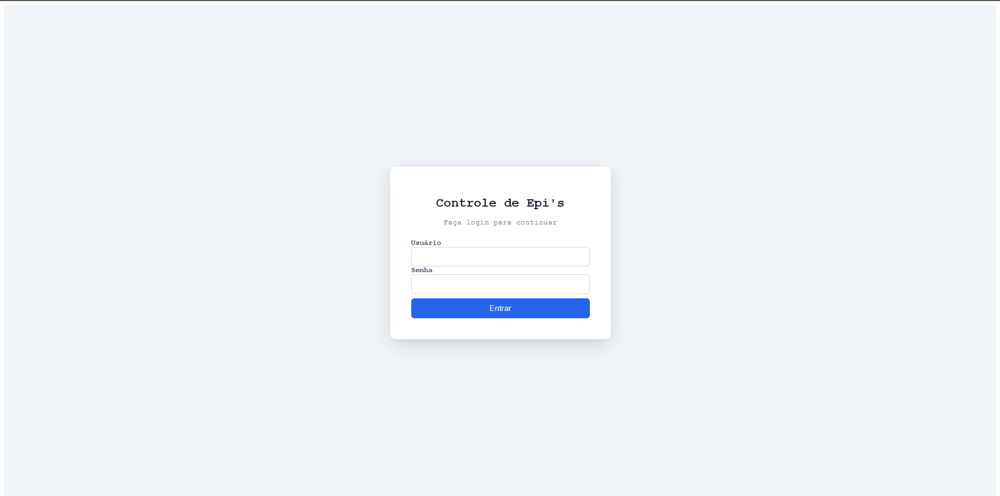
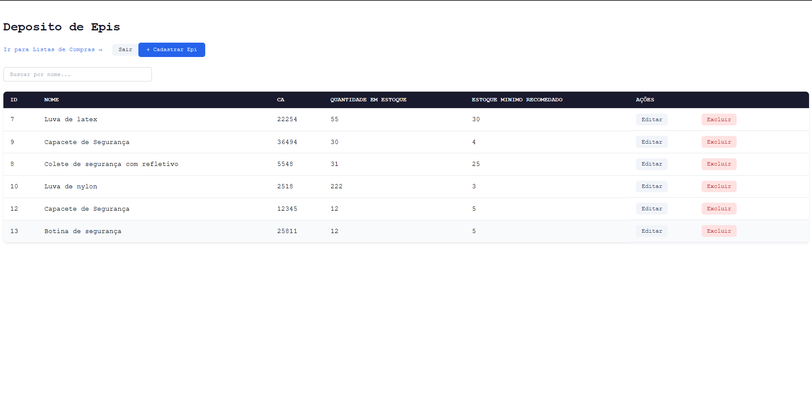
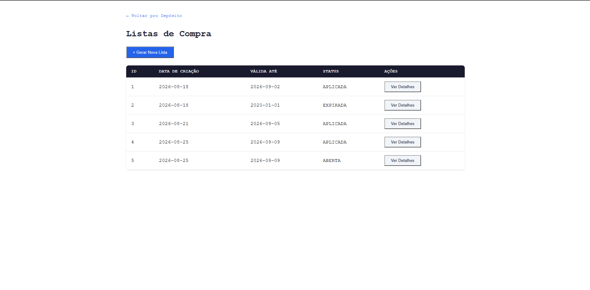

# Sistema de Controle de EPI's — Frontend

Interface Angular para o [sistema de controle de estoque de EPIs](https://github.com/dev-gustavo-costa/controle-epis-backend) — depósito de EPIs e o fluxo completo de lista de compras (sugestão automática, exportação em PDF, aplicação no estoque).

## Funcionalidades

- Login com autenticação HTTP Basic
- Tela de Depósito: CRUD de EPIs com busca ao vivo
- Tela de Lista de Compras:
  - Geração de lista com sugestão automática de itens abaixo do estoque mínimo
  - Adição manual de qualquer EPI (para aproveitar orçamento/frete)
  - Visualização de listas salvas, com status (aberta / aplicada / expirada)
  - Download da lista em PDF
  - Aplicação da lista, informando a quantidade realmente recebida por item

## Capturas de tela

| Login | Depósito de EPIs |
|---|---|
|  |  |

| Lista de Compras |
|---|
|  |

## Stack

- Angular 22 (standalone components, signals, zoneless)
- TypeScript

## Como rodar localmente

Pré-requisitos: Node 24+, Angular CLI 22, e o [backend](https://github.com/dev-gustavo-costa/controle-epis-backend) rodando em `http://localhost:8080`.

```bash
npm install
ng serve
```

Acesse `http://localhost:4200`. Login de demonstração: `Admin` / `senha123`.

## Backend

A API que esse frontend consome está em [repositório separado](https://github.com/dev-gustavo-costa/controle-epis-backend).

## Próximos passos conhecidos

- Testes automatizados de verdade (hoje só o boilerplate padrão gerado pelo Angular CLI)
- Busca/filtro no dropdown de adicionar EPI manualmente à lista de compras
- Menu de navegação real entre as telas (hoje são só links soltos)
- Polimento visual dos botões, pra manter consistência entre as duas telas

## Licença

Projeto pessoal de portfólio. Sem licença de código aberto — todos os direitos reservados.
